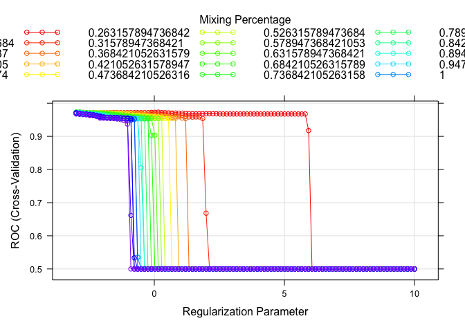

Homework 3
================
Yuki Joyama
2024-04-03

``` r
# data prep
df = read_csv("auto.csv") |> 
  mutate(
    origin = as.factor(case_when(
      origin == 1 ~ "American",
      origin == 2 ~ "European",
      origin == 3 ~ "Japanese"
    )),
    mpg_cat = as.factor(mpg_cat)
  )
```

First, I will split the dataset into two parts: training data (70%) and
test data (30%)

``` r
set.seed(1995)
data_split = initial_split(df, prop = .70)

# training data
df_train = training(data_split) 

# test data
df_test = testing(data_split)

# set up 10-fold CV
ctrl <- trainControl(
  method = "cv",
  number = 10,
  summaryFunction = twoClassSummary,
  classProbs = TRUE
)
```

# (a)

In this section, I will fit an elastic net model using the training
data.

``` r
set.seed(1995)

# find tuning parameter by CV
enet.fit <- 
  train(
    x = df_train[1:7],
    y = df_train$mpg_cat,
    data = df_train,
    method = "glmnet",
    metric = "ROC",
    tuneGrid = expand.grid(
      alpha = seq(0, 1, length = 20),
      lambda = exp(seq(-3, 10, length = 100))
    ),
    trControl = ctrl
  )

# check the best tuning parameter
enet.fit$bestTune
```

    ##         alpha     lambda
    ## 401 0.2105263 0.04978707

``` r
# plot RMSE, lambda and alpha
myCol <- rainbow(25)
myPar <- list(
  superpose.symbol = list(col = myCol),
  superpose.line = list(col = myCol)
)

plot(enet.fit, par.settings = myPar, xTrans = log)
```

<!-- -->

``` r
# coefficients in the final model
coef(enet.fit$finalModel, s = enet.fit$bestTune$lambda)
```

    ## 8 x 1 sparse Matrix of class "dgCMatrix"
    ##                        s1
    ## (Intercept)   4.573157714
    ## cylinders     0.352002741
    ## displacement  0.006429759
    ## horsepower    0.013527149
    ## weight        0.001108241
    ## acceleration  .          
    ## year         -0.158047038
    ## origin        .

10-fold cross validation is implemented to select the optimal tuning
parameters ($\alpha =$ 0.21, $\lambda =$ 0.05).  
The model includes five predictors. `acceleratio` and `origin` were
found to be redundant in this model.

# (b)

# (c)

# (d)

# (e)
