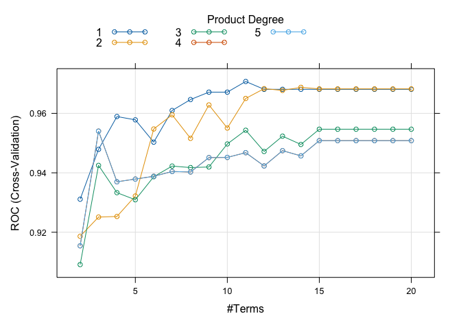

Homework 3
================
Yuki Joyama
2024-04-03

``` r
# data prep
df = read_csv("auto.csv") 
```

First, I will split the dataset into two parts: training data (70%) and
test data (30%)

``` r
set.seed(1995)
data_split = initial_split(df, prop = .70)

# training data
df_train = training(data_split) 

# test data
df_test = testing(data_split)

# set up 10-fold CV
ctrl <- trainControl(
  method = "cv",
  number = 10,
  summaryFunction = twoClassSummary,
  classProbs = TRUE
)
```

# (a)

In this section, I will fit an elastic net model as a penalized logistic
regression.

``` r
set.seed(1995)

# find tuning parameter by CV
enet.fit <- 
  train(
    x = df_train[1:7],
    y = df_train$mpg_cat,
    data = df_train,
    method = "glmnet",
    metric = "ROC",
    tuneGrid = expand.grid(
      alpha = seq(0, 1, length = 20),
      lambda = exp(seq(-3, 10, length = 100))
    ),
    trControl = ctrl
  )

# check the best tuning parameter
enet.fit$bestTune
```

    ##          alpha     lambda
    ## 1201 0.6315789 0.04978707

``` r
# plot RMSE, lambda and alpha
myCol <- rainbow(25)
myPar <- list(
  superpose.symbol = list(col = myCol),
  superpose.line = list(col = myCol)
)

plot(enet.fit, par.settings = myPar, xTrans = log)
```

<!-- -->

``` r
# coefficients in the final model
coef(enet.fit$finalModel, s = enet.fit$bestTune$lambda)
```

    ## 8 x 1 sparse Matrix of class "dgCMatrix"
    ##                        s1
    ## (Intercept)   3.686115761
    ## cylinders     0.310176287
    ## displacement  0.005605687
    ## horsepower    0.008097918
    ## weight        0.001260020
    ## acceleration  .          
    ## year         -0.140885415
    ## origin       -0.002635188

10-fold cross validation is implemented to select the optimal tuning
parameters ($\alpha =$ 0.63, $\lambda =$ 0.05).  
The model includes five predictors. `acceleration` was found to be
redundant in this model.

# (b)

Setting a probability threshold to 0.5 and determine the class labels.
If $Pr(Y = \text{low}|X)<0.5$, we will classify this as `low`, otherwise
`high`.

``` r
test.pred.prob <- predict(enet.fit, newdata = df_test, type = "prob")
test.pred <- rep("high", nrow(df_test))
test.pred[test.pred.prob[1] < 0.5] <- "low"
```

The confusion matrix using the test data is as follows.

``` r
confusionMatrix(
  data = as.factor(test.pred),
  reference = as.factor(df_test$mpg_cat)
)
```

    ## Confusion Matrix and Statistics
    ## 
    ##           Reference
    ## Prediction high low
    ##       high   50   9
    ##       low     2  57
    ##                                           
    ##                Accuracy : 0.9068          
    ##                  95% CI : (0.8393, 0.9525)
    ##     No Information Rate : 0.5593          
    ##     P-Value [Acc > NIR] : < 2e-16         
    ##                                           
    ##                   Kappa : 0.8136          
    ##                                           
    ##  Mcnemar's Test P-Value : 0.07044         
    ##                                           
    ##             Sensitivity : 0.9615          
    ##             Specificity : 0.8636          
    ##          Pos Pred Value : 0.8475          
    ##          Neg Pred Value : 0.9661          
    ##              Prevalence : 0.4407          
    ##          Detection Rate : 0.4237          
    ##    Detection Prevalence : 0.5000          
    ##       Balanced Accuracy : 0.9126          
    ##                                           
    ##        'Positive' Class : high            
    ## 

Given the confusion matrix with `high` being the `Positive Class`, we
can see that:  
True Positive (TP) = 50  
True Negative (TN) = 57  
False Positive (FP) = 9  
False Negative (FN) = 2

The metric Accuracy ($\frac{TP+TN}{TP+FP+TN+FN}$) signifies that 90.68%
of the samples were correctly classified out of all the samples.
Sensitivity ($\frac{TP}{TP+FN}$) indicates that out of all actual
Positive Class instances, 96.15% were correctly predicted as `high`. On
the other hand, Specificity ($\frac{TN}{FP+TN}$), which is 86.36%,
represents the proportion of actual Negative Class instances correctly
predicted as `low`.

# (c)

Here, I will train a MARS model using the training data.

``` r
set.seed(1995)

# fit mars model
mars.fit <- train(
  x = df_train[1:7],
  y = df_train$mpg_cat,
  method = "earth",
  tuneGrid = expand.grid(degree = 1:5, nprune = 2:20),
  metric = "ROC",
  trControl = ctrl
)

summary(mars.fit$finalModel)
```

    ## Call: earth(x=tbl_df[274,7], y=factor.object, keepxy=TRUE,
    ##             glm=list(family=function.object, maxit=100), degree=1, nprune=11)
    ## 
    ## GLM coefficients
    ##                            low
    ## (Intercept)          1.2345750
    ## h(4-cylinders)       3.2372865
    ## h(displacement-151)  0.0666967
    ## h(displacement-232) -0.2391780
    ## h(displacement-262)  0.1598567
    ## h(horsepower-72)    -0.3494185
    ## h(horsepower-75)     0.4166781
    ## h(horsepower-133)    6.7119843
    ## h(3459-weight)      -0.0042551
    ## h(78-year)           0.3123450
    ## h(year-78)          -1.1279091
    ## 
    ## GLM (family binomial, link logit):
    ##  nulldev  df       dev  df   devratio     AIC iters converged
    ##  379.129 273   76.2609 263      0.799   98.26    23         1
    ## 
    ## Earth selected 11 of 16 terms, and 5 of 7 predictors (nprune=11)
    ## Termination condition: Reached nk 21
    ## Importance: displacement, year, weight, horsepower, cylinders, ...
    ## Number of terms at each degree of interaction: 1 10 (additive model)
    ## Earth GCV 0.0644561    RSS 15.05756    GRSq 0.7433841    RSq 0.7796063

``` r
# best tuning parameters
mars.fit$bestTune
```

    ##    nprune degree
    ## 10     11      1

``` r
# plot
plot(mars.fit)
```

<!-- -->

``` r
# pdp
pdp::partial(mars.fit, pred.var = "displacement", grid.resolution = 200) |> autoplot()
```

<!-- -->

``` r
# relative variable importance
vip(mars.fit$finalModel, type = "nsubsets")
```

<!-- -->

The best tuning parameters selected from the cross validation is nprune
(the upper bound of the number of terms) = 11 and degree = 1.

The final model can be expressed as the following:  
$\hat{y}$ = 1.235 - 0.239 $\times$ h(displacement-232) - 1.128 $\times$
h(year-78) + 0.312 $\times$ h(78-year) - 0.004 $\times$ h(3459-weight) +
0.067 $\times$ h(displacement-151) + 0.417 $\times$ h(horsepower-75) +
6.712 $\times$ h(horsepower-133) + 0.16 $\times$ h(displacement-262) -
0.349 $\times$ h(horsepower-72) + 3.237 $\times$ h(4-cylinders)  
where $h(.)$ is hinge function.

Now, let’s compare the two models.

``` r
res <- resamples(
  list(
    elastic_net = enet.fit,
    mars = mars.fit
  )
)

summary(res)
```

    ## 
    ## Call:
    ## summary.resamples(object = res)
    ## 
    ## Models: elastic_net, mars 
    ## Number of resamples: 10 
    ## 
    ## ROC 
    ##                  Min.   1st Qu.    Median      Mean   3rd Qu. Max. NA's
    ## elastic_net 0.9395604 0.9621795 0.9655678 0.9724542 0.9923077    1    0
    ## mars        0.9285714 0.9634615 0.9787546 0.9707326 0.9825092    1    0
    ## 
    ## Sens 
    ##                  Min.   1st Qu.    Median      Mean   3rd Qu. Max. NA's
    ## elastic_net 0.8666667 0.9500000 1.0000000 0.9728571 1.0000000    1    0
    ## mars        0.7333333 0.8666667 0.9285714 0.9119048 0.9821429    1    0
    ## 
    ## Spec 
    ##                  Min.   1st Qu.    Median      Mean   3rd Qu.      Max. NA's
    ## elastic_net 0.6923077 0.8461538 0.8846154 0.8538462 0.9230769 0.9230769    0
    ## mars        0.7692308 0.8461538 0.9230769 0.8923077 0.9230769 1.0000000    0

``` r
bwplot(res, metric = "ROC")
```

<!-- -->

Based on the results, the MARS model exhibits a larger median ROC,
suggesting improved prediction performance compared to logistic
regression.

# (d)

In this section, I will perform linear discriminant analysis using the
training data.

``` r
lda.fit1 <- lda(mpg_cat ~., data = df_train)
lda.fit1
```

    ## Call:
    ## lda(mpg_cat ~ ., data = df_train)
    ## 
    ## Prior probabilities of groups:
    ##      high       low 
    ## 0.5255474 0.4744526 
    ## 
    ## Group means:
    ##      cylinders displacement horsepower   weight acceleration     year   origin
    ## high  4.166667     115.6979   78.84722 2337.493     16.52708 77.59028 1.909722
    ## low   6.700000     267.0615  128.19231 3606.038     15.03154 74.69231 1.153846
    ## 
    ## Coefficients of linear discriminants:
    ##                        LD1
    ## cylinders     0.4427082930
    ## displacement  0.0004154543
    ## horsepower   -0.0092609288
    ## weight        0.0012859297
    ## acceleration  0.0160904075
    ## year         -0.1260946087
    ## origin       -0.1076052271

The group means represent the average values of each predictor within
each `mpg_cat` group. For example, we can see that in `high` group, the
mean number of cylinders is 4.17 whereas in `low` group, it’s 6.70. The
linear discriminant variables are plotted below:

``` r
plot(lda.fit1, col = as.numeric(df_train$mpg_cat))
```

<!-- -->

# (e)

``` r
set.seed(1995)

lda.fit <- train(
  x = df_train[1:7],
  y = df_train$mpg_cat,
  method = "lda",
  metric = "ROC",
  trControl = ctrl
)

res <- resamples(
  list(
    elastic_net = enet.fit,
    mars = mars.fit,
    lda = lda.fit
  )
)

summary(res)
```

    ## 
    ## Call:
    ## summary.resamples(object = res)
    ## 
    ## Models: elastic_net, mars, lda 
    ## Number of resamples: 10 
    ## 
    ## ROC 
    ##                  Min.   1st Qu.    Median      Mean   3rd Qu. Max. NA's
    ## elastic_net 0.9395604 0.9621795 0.9655678 0.9724542 0.9923077    1    0
    ## mars        0.9285714 0.9634615 0.9787546 0.9707326 0.9825092    1    0
    ## lda         0.8846154 0.9346154 0.9598901 0.9554945 0.9766484    1    0
    ## 
    ## Sens 
    ##                  Min.   1st Qu.    Median      Mean   3rd Qu. Max. NA's
    ## elastic_net 0.8666667 0.9500000 1.0000000 0.9728571 1.0000000    1    0
    ## mars        0.7333333 0.8666667 0.9285714 0.9119048 0.9821429    1    0
    ## lda         0.8666667 0.9464286 1.0000000 0.9661905 1.0000000    1    0
    ## 
    ## Spec 
    ##                  Min.   1st Qu.    Median      Mean   3rd Qu.      Max. NA's
    ## elastic_net 0.6923077 0.8461538 0.8846154 0.8538462 0.9230769 0.9230769    0
    ## mars        0.7692308 0.8461538 0.9230769 0.8923077 0.9230769 1.0000000    0
    ## lda         0.6153846 0.7884615 0.8461538 0.8307692 0.9038462 0.9230769    0

``` r
bwplot(res, metric = "ROC")
```

<!-- -->

``` r
# test data performance
enet.pred <- predict(enet.fit, newdata = df_test, type = "prob")[,2]
mars.pred <- predict(mars.fit, newdata = df_test, type = "prob")[,2]
lda.pred <- predict(lda.fit, newdata = df_test, type = "prob")[,2]

roc.enet <- roc(df_test$mpg_cat, enet.pred)
roc.mars <- roc(df_test$mpg_cat, mars.pred)
roc.lda <- roc(df_test$mpg_cat, lda.pred)

auc <- c(roc.enet$auc[1], roc.mars$auc[1], roc.lda$auc[1])

modelNames <- c("elastic_net", "mars", "lda")

ggroc(list(roc.enet, roc.mars, roc.lda), legacy.axes = TRUE) +
  scale_color_discrete(labels = paste0(modelNames, "(", round(auc, 3), ")"), name = "Models (AUC)")
```

<!-- -->

The resampling results shows that the MARS model has the largest median
ROC among the three models.  
Thus, I would prefer to utilize the MARS model for predicting the
response variable. Next, I will generate ROC curves for all three models
using the test data.  
We can see that the MARS model has the largest AUC of 0.978.

``` r
test.pred.prob <- predict(mars.fit, newdata = df_test, type = "raw")

confusionMatrix(
  data = test.pred.prob,
  reference = as.factor(df_test$mpg_cat)
)
```

    ## Confusion Matrix and Statistics
    ## 
    ##           Reference
    ## Prediction high low
    ##       high   48   7
    ##       low     4  59
    ##                                           
    ##                Accuracy : 0.9068          
    ##                  95% CI : (0.8393, 0.9525)
    ##     No Information Rate : 0.5593          
    ##     P-Value [Acc > NIR] : <2e-16          
    ##                                           
    ##                   Kappa : 0.812           
    ##                                           
    ##  Mcnemar's Test P-Value : 0.5465          
    ##                                           
    ##             Sensitivity : 0.9231          
    ##             Specificity : 0.8939          
    ##          Pos Pred Value : 0.8727          
    ##          Neg Pred Value : 0.9365          
    ##              Prevalence : 0.4407          
    ##          Detection Rate : 0.4068          
    ##    Detection Prevalence : 0.4661          
    ##       Balanced Accuracy : 0.9085          
    ##                                           
    ##        'Positive' Class : high            
    ## 

The misclassification error rate can be obtained by  
1 - accuracy = 1 - 0.9068 = **0.0932**
