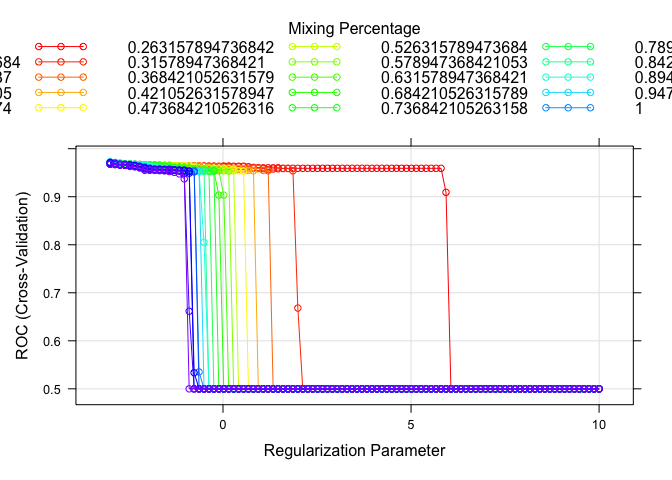
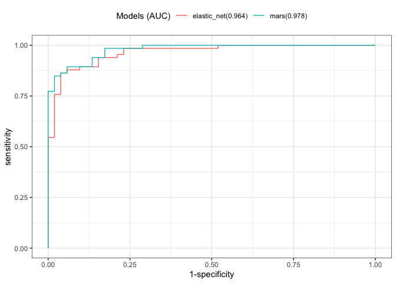

Homework 3
================
Yuki Joyama
2024-04-03

``` r
# data prep
df = read_csv("auto.csv") |> 
  mutate(
    origin = as.factor(case_when(
      origin == 1 ~ "American",
      origin == 2 ~ "European",
      origin == 3 ~ "Japanese"
    )),
    mpg_cat = as.factor(mpg_cat)
  )
```

First, I will split the dataset into two parts: training data (70%) and
test data (30%)

``` r
set.seed(1995)
data_split = initial_split(df, prop = .70)

# training data
df_train = training(data_split) 

# test data
df_test = testing(data_split)

# set up 10-fold CV
ctrl <- trainControl(
  method = "cv",
  number = 10,
  summaryFunction = twoClassSummary,
  classProbs = TRUE
)
```

# (a)

In this section, I will fit an elastic net model as a penalized logistic
regression.

``` r
set.seed(1995)

# find tuning parameter by CV
enet.fit <- 
  train(
    x = df_train[1:7],
    y = df_train$mpg_cat,
    data = df_train,
    method = "glmnet",
    metric = "ROC",
    tuneGrid = expand.grid(
      alpha = seq(0, 1, length = 20),
      lambda = exp(seq(-3, 10, length = 100))
    ),
    trControl = ctrl
  )

# check the best tuning parameter
enet.fit$bestTune
```

    ##         alpha     lambda
    ## 401 0.2105263 0.04978707

``` r
# plot RMSE, lambda and alpha
myCol <- rainbow(25)
myPar <- list(
  superpose.symbol = list(col = myCol),
  superpose.line = list(col = myCol)
)

plot(enet.fit, par.settings = myPar, xTrans = log)
```

<!-- -->

``` r
# coefficients in the final model
coef(enet.fit$finalModel, s = enet.fit$bestTune$lambda)
```

    ## 8 x 1 sparse Matrix of class "dgCMatrix"
    ##                        s1
    ## (Intercept)   4.573157714
    ## cylinders     0.352002741
    ## displacement  0.006429759
    ## horsepower    0.013527149
    ## weight        0.001108241
    ## acceleration  .          
    ## year         -0.158047038
    ## origin        .

10-fold cross validation is implemented to select the optimal tuning
parameters ($\alpha =$ 0.21, $\lambda =$ 0.05).  
The model includes five predictors. `acceleratio` and `origin` were
found to be redundant in this model.

# (b)

Setting a probability threshold to 0.5 and determine the class labels.
If $Pr(Y = \text{low}|X)<0.5$, we will classify this as `low`, otherwise
`high`.

``` r
test.pred.prob <- predict(enet.fit, newdata = df_test, type = "prob")
test.pred <- rep("high", nrow(df_test))
test.pred[test.pred.prob[1] < 0.5] <- "low"
```

The confusion matrix using the test data is as follows.

``` r
confusionMatrix(
  data = as.factor(test.pred),
  reference = df_test$mpg_cat
)
```

    ## Confusion Matrix and Statistics
    ## 
    ##           Reference
    ## Prediction high low
    ##       high   49   9
    ##       low     3  57
    ##                                           
    ##                Accuracy : 0.8983          
    ##                  95% CI : (0.8291, 0.9463)
    ##     No Information Rate : 0.5593          
    ##     P-Value [Acc > NIR] : 9.512e-16       
    ##                                           
    ##                   Kappa : 0.7962          
    ##                                           
    ##  Mcnemar's Test P-Value : 0.1489          
    ##                                           
    ##             Sensitivity : 0.9423          
    ##             Specificity : 0.8636          
    ##          Pos Pred Value : 0.8448          
    ##          Neg Pred Value : 0.9500          
    ##              Prevalence : 0.4407          
    ##          Detection Rate : 0.4153          
    ##    Detection Prevalence : 0.4915          
    ##       Balanced Accuracy : 0.9030          
    ##                                           
    ##        'Positive' Class : high            
    ## 

Given the confusion matrix with `high` being the `Positive Class`, we
can see that:  
True Positive (TP) = 49  
True Negative (TN) = 57  
False Positive (FP) = 9  
False Negative (FN) = 3

The metric Accuracy ($\frac{TP+TN}{TP+FP+TN+FN}$) signifies that 89.83%
of the samples were correctly classified out of all the samples.
Sensitivity ($\frac{TP}{TP+FN}$) indicates that out of all actual
Positive Class instances, 94.23% were correctly predicted as `high`. On
the other hand, Specificity ($\frac{TN}{FP+TN}$), which is 86.36%,
represents the proportion of actual Negative Class instances correctly
predicted as `low`.

# (c)

Here, I will train a MARS model using the training data.

``` r
set.seed(1995)

# fit mars model
mars.fit <- train(
  x = df_train[1:7],
  y = df_train$mpg_cat,
  method = "earth",
  tuneGrid = expand.grid(degree = 1:5, nprune = 2:20),
  metric = "ROC",
  trControl = ctrl
)

summary(mars.fit$finalModel)
```

    ## Call: earth(x=tbl_df[274,7], y=factor.object, keepxy=TRUE,
    ##             glm=list(family=function.object, maxit=100), degree=1, nprune=11)
    ## 
    ## GLM coefficients
    ##                            low
    ## (Intercept)          1.2345750
    ## h(4-cylinders)       3.2372865
    ## h(displacement-151)  0.0666967
    ## h(displacement-232) -0.2391780
    ## h(displacement-262)  0.1598567
    ## h(horsepower-72)    -0.3494185
    ## h(horsepower-75)     0.4166781
    ## h(horsepower-133)    6.7119843
    ## h(3459-weight)      -0.0042551
    ## h(78-year)           0.3123450
    ## h(year-78)          -1.1279091
    ## 
    ## GLM (family binomial, link logit):
    ##  nulldev  df       dev  df   devratio     AIC iters converged
    ##  379.129 273   76.2609 263      0.799   98.26    23         1
    ## 
    ## Earth selected 11 of 16 terms, and 5 of 8 predictors (nprune=11)
    ## Termination condition: Reached nk 21
    ## Importance: displacement, year, weight, horsepower, cylinders, ...
    ## Number of terms at each degree of interaction: 1 10 (additive model)
    ## Earth GCV 0.0644561    RSS 15.05756    GRSq 0.7433841    RSq 0.7796063

``` r
# best tuning parameters
mars.fit$bestTune
```

    ##    nprune degree
    ## 10     11      1

``` r
# plot
plot(mars.fit)
```

<!-- -->

``` r
# pdp
pdp::partial(mars.fit, pred.var = "displacement", grid.resolution = 200) |> autoplot()
```

<!-- -->

``` r
# relative variable importance
vip(mars.fit$finalModel, type = "nsubsets")
```

<!-- -->

The best tuning parameters selected from the cross validation is nprune
(the upper bound of the number of terms) = 11 and degree = 1.

The final model can be expressed as the following:  
$\hat{y}$ = 1.235 - 0.239 $\times$ h(displacement-232) - 1.128 $\times$
h(year-78) + 0.312 $\times$ h(78-year) - 0.004 $\times$ h(3459-weight) +
0.067 $\times$ h(displacement-151) + 0.417 $\times$ h(horsepower-75) +
6.712 $\times$ h(horsepower-133) + 0.16 $\times$ h(displacement-262) -
0.349 $\times$ h(horsepower-72) + 3.237 $\times$ h(4-cylinders)  
where $h(.)$ is hinge function.

Now, let’s compare the two models.

``` r
res <- resamples(
  list(
    elastic_net = enet.fit,
    mars = mars.fit
  )
)

summary(res)
```

    ## 
    ## Call:
    ## summary.resamples(object = res)
    ## 
    ## Models: elastic_net, mars 
    ## Number of resamples: 10 
    ## 
    ## ROC 
    ##                  Min.   1st Qu.    Median      Mean   3rd Qu. Max. NA's
    ## elastic_net 0.9395604 0.9648352 0.9692308 0.9734432 0.9881868    1    0
    ## mars        0.9285714 0.9634615 0.9787546 0.9707326 0.9825092    1    0
    ## 
    ## Sens 
    ##                  Min.   1st Qu.    Median      Mean   3rd Qu. Max. NA's
    ## elastic_net 0.8666667 0.9500000 1.0000000 0.9728571 1.0000000    1    0
    ## mars        0.7333333 0.8666667 0.9285714 0.9119048 0.9821429    1    0
    ## 
    ## Spec 
    ##                  Min.   1st Qu.    Median      Mean   3rd Qu.      Max. NA's
    ## elastic_net 0.6923077 0.8461538 0.8846154 0.8538462 0.9230769 0.9230769    0
    ## mars        0.7692308 0.8461538 0.9230769 0.8923077 0.9230769 1.0000000    0

``` r
bwplot(res, metric = "ROC")
```

<!-- -->

``` r
# test data performance
enet.pred <- predict(enet.fit, newdata = df_test, type = "prob")[,2]
mars.pred <- predict(mars.fit, newdata = df_test, type = "prob")[,2]

roc.enet <- roc(df_test$mpg_cat, enet.pred)
roc.mars <- roc(df_test$mpg_cat, mars.pred)

auc <- c(roc.enet$auc[1], roc.mars$auc[1])

modelNames <- c("elastic_net", "mars")

ggroc(list(roc.enet, roc.mars), legacy.axes = TRUE) +
  scale_color_discrete(labels = paste0(modelNames, "(", round(auc, 3), ")"), name = "Models (AUC)")
```

<!-- -->

Based on the results, the MARS model exhibits a larger Area Under the
Curve (AUC) of 0.978, suggesting enhanced prediction performance
compared to logistic regression.

# (d)

# (e)
